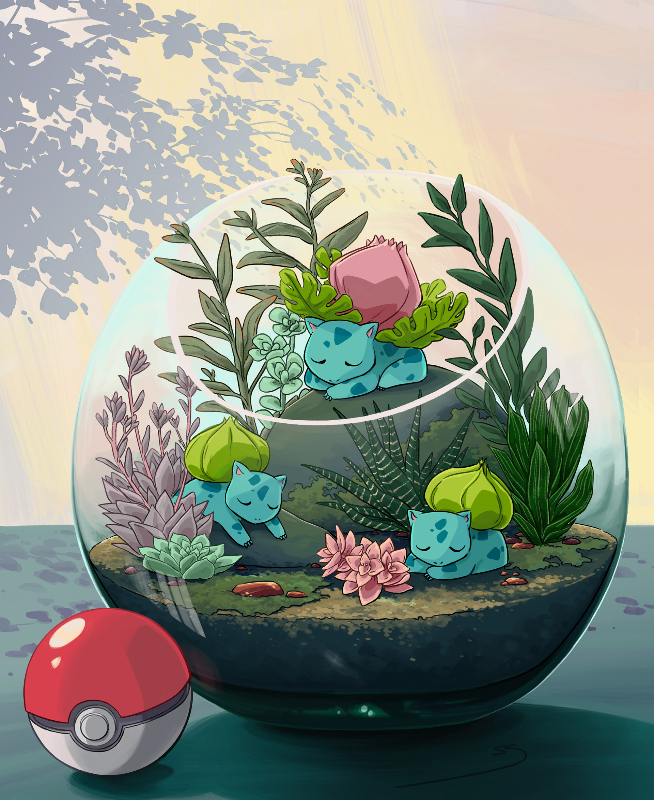

# Terrarium-2023-A

# Descripcion
proyecto de la clase programación web orientado
a practicar las bases del código HTML + CSS + JS 💕

# Autor 

Soy una estudiante de Programación web y me gusta mucho CSS y JS 🎨!

# 📑Notas de clase 
 1. HTML
 2. CSS
 3. JavaScript

